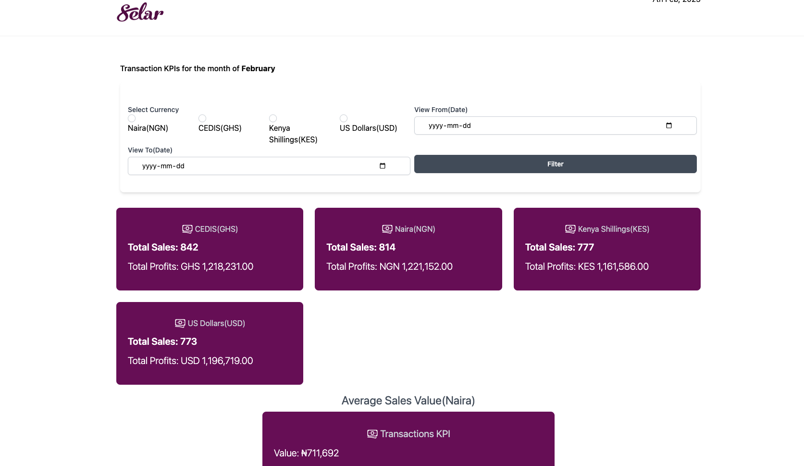
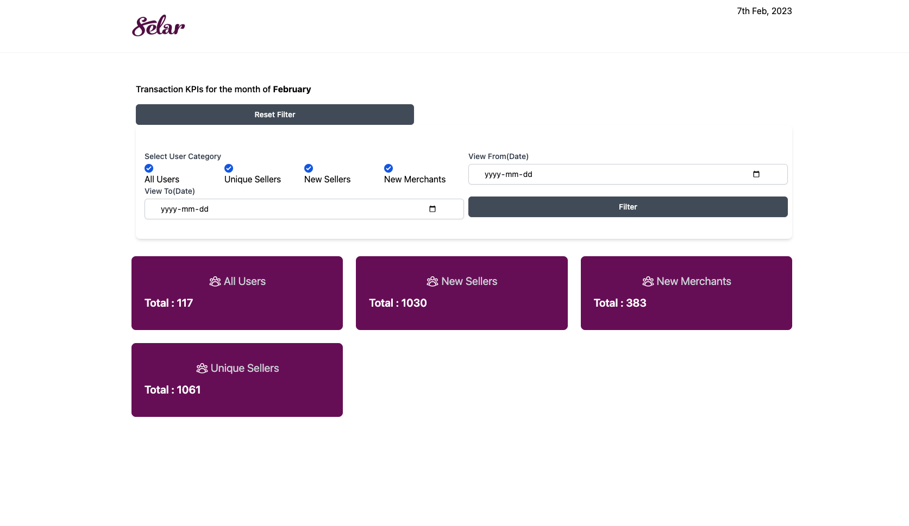
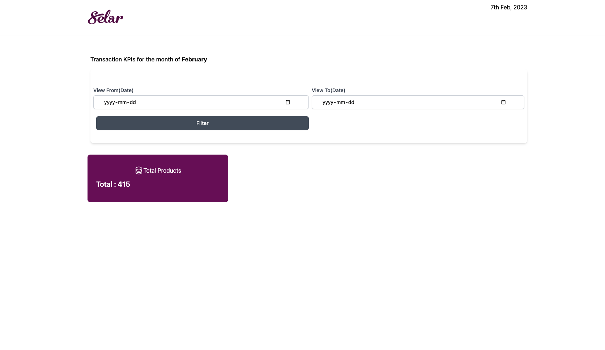

## Selar App Test

An interview test for Selar

## Technology Used
PHP/Laravel, MYSQL, Tailwind CSS, and HTML

## Guide
- Ensure your php environment is on version 7.2 since the project is based on Laravel 7
- Configure the env of the file project and link the env
- Run php artisan serve then visit the generated localhost link; eg: <link>http://127.0.0.1/ <link>
- Visit each section of the KPI
- Each section of the KPI can be filtered by date.
- Currency converter API is being consumed for the conversion from other currencies to Naira in order to calculate the Average Sales in Naira and this 
will require internet.

### Screenshots

