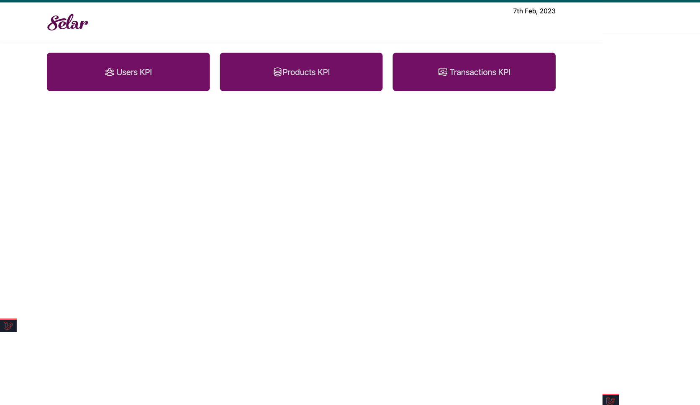

## Selar App Test

An interview test for Selar

## Technology Used
PHP/Laravel, MYSQL, Tailwind CSS, and HTML

## Guide
- Ensure your php environment is on version 7.2 since the project is based on Laravel 7
- Configure the env of the file project and link the database
- If the tables do not initially exist, run  <b>php artisan migrate</b>
- Run <b>php artisan db:seed <b> to populate the database
- Run <b> php artisan db:seed --class=PurchaseSeeder <b> to seed the purchases' table alone. Note that this can only be done after the users 'table has been seeded
- Run <b> php artisan db:seed --class=ProductSeeder <b> to seed the products' table alone. Note that this can only be done after the users' table has been seeded
- Run php artisan serve then visit the generated localhost link; eg: <link>http://127.0.0.1/ <link>
- Visit each section of the KPI
- Each section of the KPI can be filtered by date.
- Currency converter API is being consumed for the conversion from other currencies to Naira in order to calculate the Average Sales in Naira and this 
will require internet.

### Screenshots

